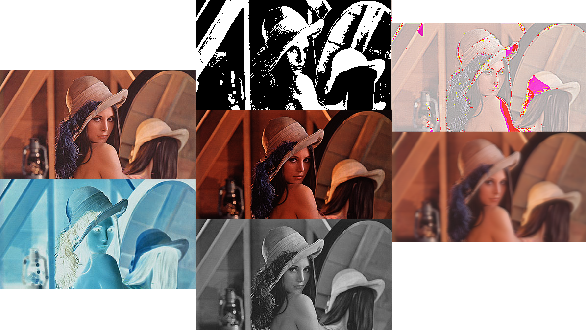

# Filtrage_Image_SDL
Filtrage d'image en C en utilisant la Simple DirectMedia Layer

Ce programme utilise la SDL 1.2 (portage vers SDL 2 en cours).
Il a été réalisé sous linux et nécessite d'installer les paquets complémentaires suivants:
* libsdl-image1.2
* libsdl-mixer1.2

Il permet de réaliser des opérations simples de filtrage et de traitement d'image.

Il permet de:
* Inverser les couleurs (touche 'i')
* Changer la luminosité (touche 'l' + fleche haut/bas)
* Filtre moyenneur (floutage gaussien) (touche 'm')
* Détourage primaire (touche 'd')
* Passer en noir & blanc (touche 'n')
* Binariser l'image (setup des deux couleurs + touche 'b' + fleche haut/bas)
* Quantification n-bits (setup du nb de bits + touche 'q' + fleche haut/bas)
* Exporter le résultat dans un fichier nommé "save.bmp" (touche 's')

# ToDo:
* Faire Doc
* Utiliser getopt() pour les option et faire une man page pour la CLI
* Améliorer le Makefile
* Résolution spatiale (échantillonage spatiale)
* Masquage de zone (seuil et position 'a' paramètrables)
* Étirement de l'histogramme (correction de la dynamique)
* Égalisation d'histogramme (pour améliorer le contraste)
* Histogramme exponentiel
* Histogramme cubique
* Histogramme par couleur quantifée
* Constraste (augmentation et diminution)
* Détourage
* Représentation spectrale
* Bruit gaussien / sel et poivre
* Filtre moyenneur
* Filtre médian
